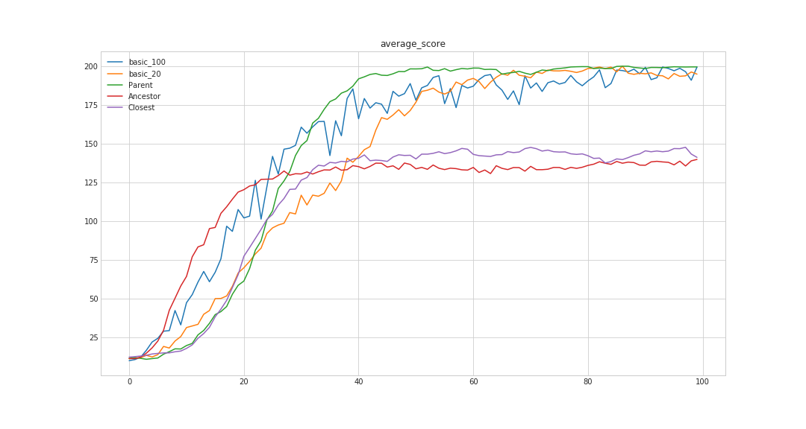

Evolution strategies are a class of stochastic, derivative-free black-box optimization algorithms. In an evolution strategy, individuals denoted as \\((x_i) \in \mathbb{R}^n \\) are sampled from a multivariate gaussian distribution \\(\mathcal{N}(\mu, \Sigma)\\). The parameters of this distribution are then modified based on the fitness \\(J(x_i) \in \mathbb{R}\\) of the individuals, in a way that maximizes the expected fitness of the individuals of the next generations. To sum it up in an equation this means that ES algorithms work on the parameters of the distribution, \\(\theta=(\mu, \Sigma)\\) in order to maximize the following expectation:

\\[
\mathbb{E}_{x \sim p(\theta)}[J(x)],
\\]

where \\(J\\) is the fitness function that we are trying to optimize. Recently this approach as proved to be competitive on reinforcement learning tasks, thanks to easy parallelization, as can be read in [this OpenAI post](https://blog.openai.com/evolution-strategies/).

### Sample reuse

Unlike DQN or other deep reinforcement learning algorithms, ES are episode-based methods, meaning that the only information used by the algorithms is the final fitness of the sampled individuals. This tends to make episode-based methods terribly sample inefficient, because to obtain new information, a full evaluation is needed, which can be time-consuming. In this post we introduce a few natural ideas that improve sample efficiency of ES algorithms.

The main principle behind those ideas is that in their usual descriptions, most ES algorithms have no memory: an individual that is sampled at timestep \\(t\\) and its fitness are discarded just after the adaptation step has ended. We propose here instead to make a better use of all those samples by adding them into a memory, which we will call the archive, \\(\mathcal{A}\\) and reusing them in different ways during the learning process. This idea was partially explored in (Sun et al. 2009) in a method called importance mixing which we will explain shortly after, but was only used to reuse samples from the previous generation to get samples from the current generation, whereas we introduce methods to reuse samples from potentially all previous generations.

### Importance Mixing

Importance mixing is a technique used to generate sample from a given distribution using samples previously generated from another, supposedly close distribution. Suppose that we have a two pdf \\( p(z,\theta) \\) and \\( p(z,\theta^\prime)\\) and an individual \\(z \sim p(., \theta^\prime) \\). We want a probabilistic process that would allow us to legitimately see \\(z\\) as generated from \\(p(., \theta)\\). To do this we introduce \\(\alpha \in [0,1]\\) and do the following:
1. Rejection sampling: we choose to accept \\(z\\) as an individual generated from \\(p(., \theta)\\) with probability \\(1 \land (1 - \alpha)\frac{p(z, \theta)}{p(z, \theta^\prime)}\\).
2. Inverse rejection sampling: if the above step failed, we draw another \\(z^\prime\\) from \\(p(., \theta)\\) and accept it with probability \\(\alpha \lor (1 - \frac{p(z, \theta^\prime)}{p(z, \theta)})\\) and repeat this step untill a sample is finally accepted.

It can be shown that by following this protocol we end up with samples that follow the desired probabilistic law. Both steps are important for this to work. During the first step we accept individuals with a probability that is proportional to the ratio of the densities: a sample generated with parameters \\(\theta^\prime\\) is more likely to be accepted in the regions where the desired density is greater or where the ratio of the two densities is of the same magnitude. But if we were to stop here we would bias the samples obtained towards the region where reuse probability is high. The second step ensures that we compensate for this bias: the probability that a newly sampled individual is accepted will be a contrario lower in the regions where the desired density is greater, or where the ratio is close to one. Below is an image that shows the probability of acceptance in the first step and acceptance in the second step for two gaussians with close means and covariances. (black=desired distribution, white=available samples)

 

This acceptance ratio might however be responsible for some weird behaviors as can be imagined from the figures: if the covariances are not really "compatible", the acceptance regions can take the form of an hyperbole.

\\(\alpha\\) is an hyperparameter and is called the minimal refresh rate. It balances how often  we want to accept old individuals in the first step vs how often we want to accept new individuals in the second step. If \\(\alpha\\) is close to zero, then the acceptance probability in  step 1 is at its highest, but on the other hand the acceptance probability in step 2 is really low. This leads to  higher sample reusage, but at a higher time cost since we need more draws before accepting an  individual in  the second step, especially in higher dimensions, since generating a sample \\(z\\) from a multivariate normal distribution of dimension \\(d\\) scales at least in \\(\mathcal{O}(d^2)\\) (because it involves a matrix product). \\(\alpha\\) gives a lower bound of the ratio of newly sampled individuals. This means that if each sampling takes \\(\delta t\\) seconds, then we will spend on average at least \\(n*\alpha(1-\alpha)\delta t\\) seconds waiting to accept samples.

In their paper (Sun et al. 2009) propose to apply this importance mixing mechanism to reuse samples from population \\(n-1\\) when sampling for population \\(n\\). We now propose two ways to adapt this when we have access to the archive \\(\mathcal{A}\\).

### Using the archive

First, since we're trying to maximize sample reuse, it could be tempting to apply the importance mixing to all the individuals of the archive and only keep those that were accepted. But this would undeniably bias the empirical distribution of the samples: indeed the importance mixing as introduced above needs the inverse rejection sampling to be mathematically correct (i.e generate samples from the wanted distribution). Selecting only the samples that were sucessfull in  the first step, would be like selecting only the 
coins that landed on heads when asked to select representative samples from an archive of coin toss. When the size of the population  is fixed (which is usually the case), we could however randomly sample n individuals from the archive and then apply the importance mixing step on  those individuals. But there is a chance by doing that that we might just select really poor samples and thus end up with poor reuse. In fact, if we want to maximize the probability that a sample will be reused (suppose that \\(\alpha\\) is fixed), then we want to select samples such that the ratio \\(\frac{p(z, \theta)}{p(z, \theta^\prime)}\\) is as great as possible. A first naive algorithm could be the following:
1. For all the individuals in  the archive, compute the ratio \\(\frac{p(z, \theta)}{p(z, \theta^\prime)}\\)
2. Sort the individuals by their ratio
3. Apply the importance mixing step to the \\(n\\) best samples.

We call this strategy "Best Ancestor Sampling", since when sampling for generation \\(n\\), we look at all the ancestors in the archive and select the n best. Theoretically this would be the best way to use the archive with importance mixing. However when the archive gets bigger and bigger we will have more and more ratios to evaluate, and each evaluation can be costly, especially as the dimension increases since computing the densities involve matrix products.

It would be easy however to reduce the number of required evaluations. For instance, thinking in terms of distributions rather than samples, it is easy to see that if the desired distribution and the distribution from which we have samples from are "two far apart", then it is very unlikely that we will reuse any of them. We could easily measure this distance by using quantites such as the Kullback-Leibler divergence, which happens to have a closed form when considering two gaussians. We could thus describe our new, more efficient strategy as:
1. For each of the previous populations k, compute a distance/pseudo-distance between \\(p_{\theta_n}\\) and \\(p_{\theta_k}\\) 
2. To each distribution associate a weight with respect to the value of the distances
3. Select n samples to apply importance mixing to according to those weights.

A possible choice of weighting strategy in step 2 could be to use a softmax on the inverse of the distances. As for step 3, many sampling strategy could be used. To get n individuals we could for instance first sample a previous population according to the weights of step 2, and then uniformly sample an individual from this generation. Or we could select a few populations and then sort the individuals of this population according to the ratios \\(\frac{p(z, \theta)}{p(z, \theta^\prime)}\\), just like above. In fact, by letting a hyperparameter \\(k\\) control the number of previous populations to consider and from  which we would like to select the top \\(n\\) individuals, we can get a compromise between sampling only from the previous population (\\(k=1\\)minimal cost but possibly suboptimal reuse probability), and sampling from all previous populations ( \\(k\\) big, highest cost but highest reuse probability).

\\ 2D experiments

\\ Higher dim experiments 

Average score over 5 experiments obtained in CartPole-v0 for different sampling strategies. Here instead of having a fixed \\(\alpha\\) we dynamically change it for each sample in order to get a fixed probability of acceptance (here 0.7). This allows us to properly study the convergence properties of the strategies irrespectively to their reuse capabilities. The dimension is 22.

Ancestor = best ancestor
Basic_x = no reuse strategy with population of size x
Parent = only reuse previous generation
Closest = take the closest points

\\ Problems / limits 

Scales poorly with the dimension when considering full covariance matrix -> use only diagonal matrices ?

----
****

