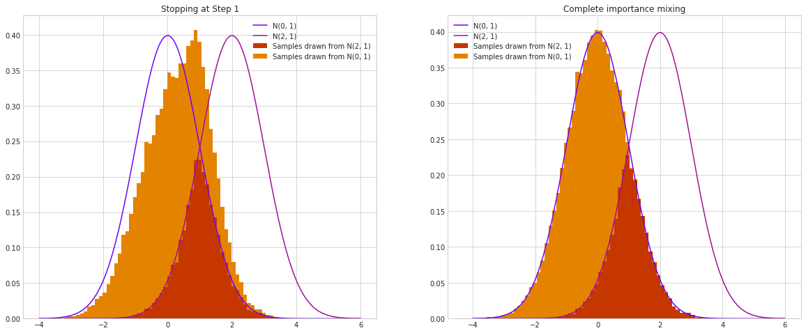
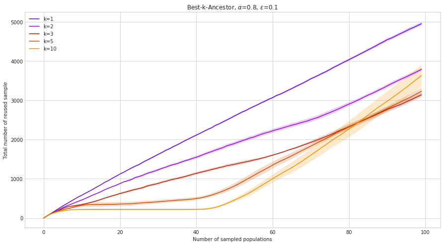
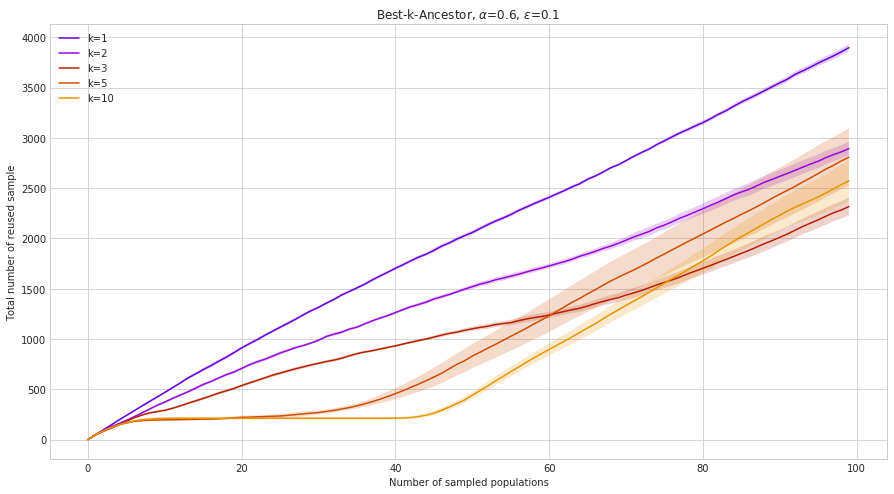
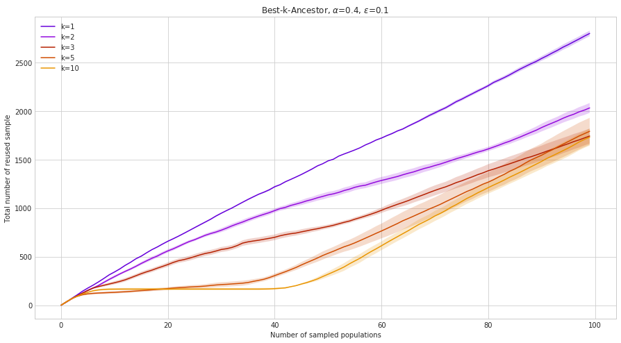
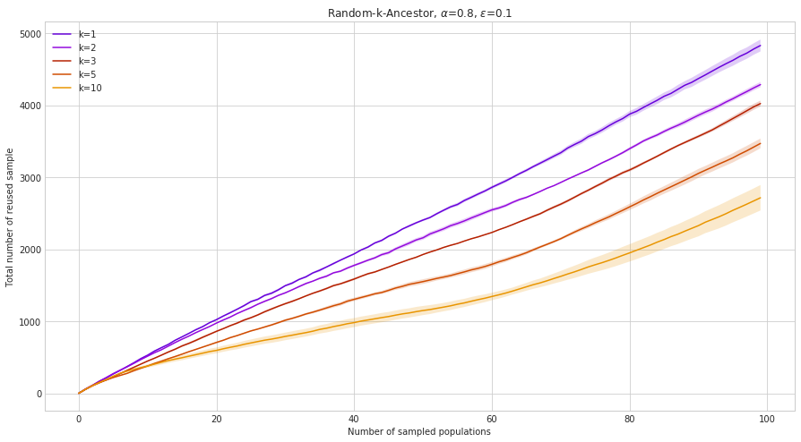
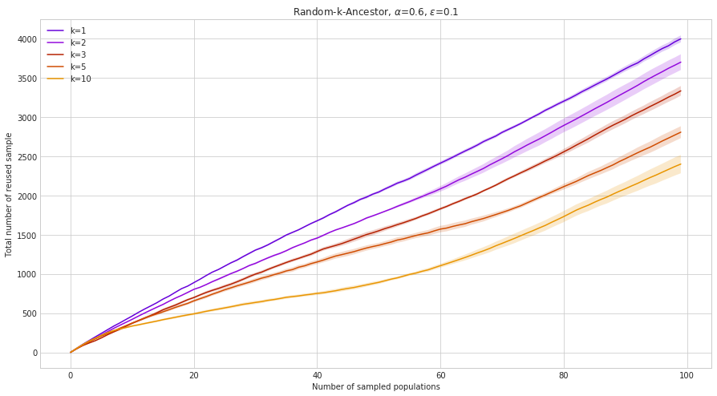
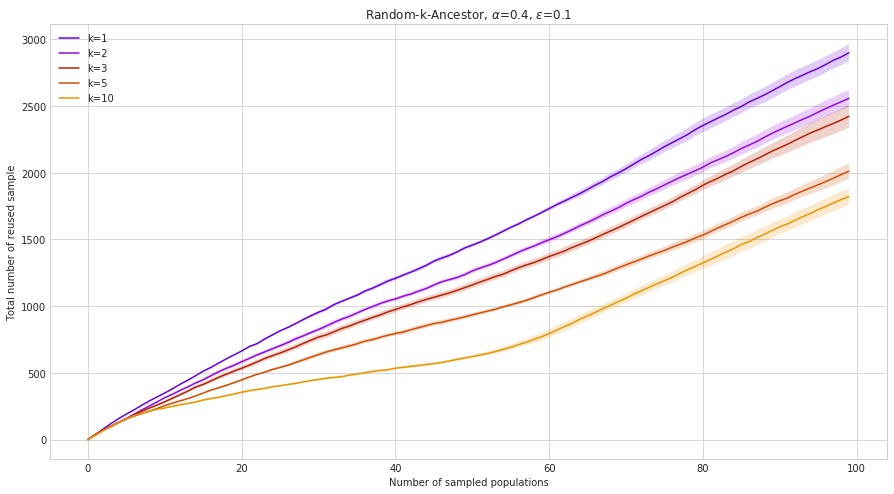

Evolution strategies (ES) are a class of stochastic, derivative-free black-box optimization algorithms. In an ES, individuals denoted as \\((x_i) \in \mathbb{R}^n \\) are sampled from a multivariate Gaussian distribution \\(\mathcal{N}(\mu, \Sigma)\\). The parameters of this distribution are then modified based on the fitness \\(J(x_i) \in \mathbb{R}\\) of the individuals, in a way that maximizes the expected fitness of the individuals of the next generations. To sum it up in an equation, this means that ES algorithms work on the parameters of the distribution, \\(\theta=(\mu, \Sigma)\\) in order to maximize the following expectation:

\\[
\mathbb{E}_{x \sim p(\theta)}[J(x)]
\\]

where \\(J\\) is the fitness function that we are trying to optimize and \\(p(\theta)=\mathcal{N}(\mu, \Sigma)\\). Recently, this approach has proved to be competitive on reinforcement learning tasks, thanks to easy parallelization, as can be read in [this OpenAI post](https://blog.openai.com/evolution-strategies/), or [this Uber labs post](https://eng.uber.com/deep-neuroevolution/).

### Sample reuse

Unlike DQN or other deep reinforcement learning algorithms which are step-based, ES are episode-based methods, meaning that the only information used by the algorithms is the final fitness of the sampled individuals over an episode. This tends to make episode-based methods terribly sample inefficient, because to obtain a new cost information, a full evaluation is needed. In this post we introduce a few ideas to improve sample efficiency of ES algorithms.

The main principle behind those ideas is that in their standard description, most ES algorithms have no memory: an individual that is sampled at timestep \\(t\\) and its fitness are discarded just after the adaptation step. Here we propose instead to make a better use of all those samples by adding them into a memory, called an archive, \\(\mathcal{A}\\) and reusing them during the learning process. This idea was partially explored in (Sun et al. 2009) in a method called "importance mixing" explained below. Importance mixing was only trying to reuse samples from the previous generation, whereas we introduce methods to reuse samples from the whole archive.

### Importance Mixing

Importance mixing is a technique used to generate sample from a given distribution using samples previously generated from another, supposedly close, distribution. Assume we have two probability density functions (pdf) \\( p(z,\theta) \\) and \\( p(z,\theta^\prime)\\). Consider that we have access to \\(n\\) samples \\((z_i)_{i=1,\dots,n}\\) drawn from \\(p(.,\theta^\prime)\\). We want a probabilistic process that would allow us to legitimately see some of the \\(z_i\\) as generated from \\(p(., \theta)\\). To do this, we introduce \\(\alpha \in [0,1]\\) and do the following:

* For each \\(z\\) in \\((z_i)_{i=1,\dots,n}\\), do: (rejection sampling step)

   * Accept \\(z\\) as an individual generated from \\(p(., \theta)\\) with probability \\(\min(1, (1 - \alpha)\frac{p(z, \theta)}{p(z, \theta^\prime)})\\)

* Then, until a total of n individuals are accepted, do: (inverse rejection sampling step)

   * Draw \\(z^\prime\\) from \\(p(., \theta)\\) and accept it with probability \\(\max(\alpha, (1 - \frac{p(z, \theta^\prime)}{p(z, \theta)}))\\) 

It can be shown that, by following this protocol, we end up with \\(n\\) samples that follow \\(p(.,\theta)\\). Both steps are important for this to work. During the first step, we accept individuals with a probability that is proportional to the ratio of the densities: a sample generated with parameters \\(\theta^\prime\\) is more likely to be accepted in the regions where the desired density is greater or where the ratio of the two densities is of the same magnitude. But if we were, after this step, to simply fill the population with samples drawn from \\(p(.,\theta)\\), we would bias the samples obtained towards the region where reuse probability is high. The second step ensures that we compensate for this bias: the probability that a newly sampled individual is accepted will be a contrario lower in the regions where the desired density is greater, or where the ratio is close to one. 
  

  
Above is an image that highlights the importance of applying both steps. We suppose that we want to generate samples following \\(\mathcal{N}(0, 1)\\), whilst reusing samples generated from \\(\mathcal{N}(2, 1)\\) with the importance mixing mechanism. On the left, after the first step, we do not apply the inverse rejection sampling step and fill the population with individuals generated from \\(\mathcal{N}(0, 1)\\). On the right, we apply the whole process. We draw 50,000 samples for each process. A bias toward high reuse regions naturally appears on the left.

The hyperparameter \\(\alpha\\) is called the minimal refresh rate. It balances how often  we want to accept old individuals in the first step vs how often we want to accept new individuals in the second step. If \\(\alpha\\) is close to zero, then the acceptance probability in  Step 1 is at its highest, but on the other hand the acceptance probability in Step 2 is really low. This leads to  higher sample reuse, but at a higher time cost. Indeed, suppose that \\(p(.,\theta)\\) and \\(p(., \theta^\prime)\\) are two multivariate Gaussians (which is usually the case), respectively \\(\mathcal{N}(\mu, \Sigma)\\) and \\(\mathcal{N}(\mu^\prime, \Sigma^\prime)\\). Then the ratios to evaluate during the importance mixing mechanism take the following form:

\\[
  \frac{p(z,\theta)}{p(z,\theta^\prime)} = \sqrt{\frac{\det(\Sigma^\prime)}{\det(\Sigma)}}e^{(z-\mu)^T\Sigma^{-1}(z-\mu) - (z-\mu^\prime)^T{\Sigma^{\prime}}^{-1}(z-\mu^\prime)},
\\]
and thus involves the evaluation of two determinants, two matrix inversions, and two matrix-vector products. For square matrices of size \\(d\\), the number of operations scales in
\\(\mathcal{O}(d^{3})\\) (although it is possible to get this complexity down to \\(\mathcal{O}(d^{2.373})\\)). The importance mixing mechanism usually scales poorly with the dimension of the optimization problem.

We modify slightly the formulation of the importance mixing mechanism as follows: we choose to have a first parameter \\(\alpha\\) control the maximum probability of sample reuse in Step 1, and have another parameter \\(\epsilon\\) control the minimal probability of acceptance in Step 2. We end up with the following algorithm:

* For each \\(z\\) in \\((z_i)_{i=1,\dots,n}\\), do: (rejection sampling step)

   * Accept \\(z\\) as an individual generated from \\(p(., \theta)\\) with probability \\(\min(\alpha, (1 - \epsilon)\frac{p(z, \theta)}{p(z, \theta^\prime)})\\)

* Then, until a total of n individuals are accepted, do: (inverse rejection sampling step)

   * Draw \\(z^\prime\\) from \\(p(., \theta)\\) and accept it with probability \\(\max(\epsilon, (1 - \alpha\frac{p(z, \theta^\prime)}{p(z, \theta)}))\\) 

This formulation is also mathematically correct in the sense that we would get samples following \\(p(.,\theta)\\). Notice that, if we were to set \\(\alpha\\) to 1, we would have the same algorithm that we had above, with the old \\(\alpha\\) being \\(\epsilon\\). But by putting a threshold on the maximal probability of reuse, it is easier to evaluate the convergence properties of the strategies that we are going to introduce, irrespectively to their sample reuse capabilities. The second arguments of the max and the min are here to prevent having a negative acceptance probability in Step 2, which would result in an infinite wait time.

In their paper (Sun et al. 2009) applied the first version of the importance mixing mechanism to reuse samples from population \\(n-1\\) when sampling for population \\(n\\). We propose to adapt this to take into account the whole archive \\(\mathcal{A}\\).

### Using the archive

Since we are trying to maximize sample reuse, it could be tempting to apply the importance mixing mechanism to all the individuals of the archive and only keep those that were accepted. But this would undeniably bias the empirical distribution of the samples: the importance mixing mechanism as introduced above needs the inverse rejection sampling to be mathematically correct (i.e generate samples from the wanted distribution). Selecting only the samples that were sucessful in  the first step would be like selecting only coins that landed on heads when asked to select samples from an archive of coin toss. When the size of the population  is fixed (which is usually the case), we could however randomly sample n individuals from the archive and then apply the importance mixing step on  those individuals. But there is a chance that by doing that we would just select really poor samples and thus end up with poor reuse. Actually, if we want to maximize the probability to reuse a sample (suppose that \\(\alpha\\) is fixed), then we want to select samples such that the ratio \\(\frac{p(z, \theta)}{p(z, \theta^\prime)}\\) is as large as possible. A first naive algorithm could be the following:
1. For all the individuals in  the archive, compute the ratio \\(\frac{p(z, \theta)}{p(z, \theta^\prime)}\\)
2. Sort the individuals by their ratio
3. Apply the importance mixing step to the \\(n\\) best samples.

This appears to be the best way to use the archive with importance mixing. But as explained above, just like choosing the samples that succeeded in the first step adds a bias in the distribution, selecting the individuals with the best ratios would also bias the distribution, and thus alter the quality of the generated population, and the convergence properties of the optimization algorithm. Besides, when the archive gets bigger and bigger, we have more and more ratios to evaluate, and each evaluation can be costly, especially as the dimension increases since computing the densities involves matrix products.

We could however reduce this bias and the number of required evaluations. For instance, thinking in terms of distributions rather than samples, it is easy to see that if the desired distribution and the distribution from which we have samples from are "too far apart", then it is very unlikely that we will reuse any of them. We would only reuse samples not really representative of the distribution they were sampled from, which are the kind of samples that would bias the population. By limiting our choice of samples to a subset of \\(\mathcal{A}\\), consisting in the samples that were generated from a close distribution, we would reduce the bias and limit the computation costs. We could easily measure this distance by using quantities such as the Kullback-Leibler divergence, which happens to have a closed form when considering two Gaussian distributions. We could thus describe a second, more efficient strategy as:
1. For each of the previous populations k, compute a distance/pseudo-distance between \\(p_{\theta_n}\\) and \\(p_{\theta_k}\\),
2. To each distribution, associate a weight with respect to the value of the distances,
3. Select n samples to apply importance mixing according to those weights.

In practice, those "close" distributions are often just the preceding distributions, which means that the first step can often be discarded by just sorting distributions according to their "age". In our experiments we choose to  have a hyperparameter \\(k\\) control the number of previous populations to consider and from  which we would like to select \\(n\\) individuals. This way we get a compromise between sampling only from the previous population (\\(k=1\\) would imply minimal cost, minimal bias but possibly suboptimal reuse probability), and sampling from all/many previous populations ( \\(k\\) big would result in highest cost, highest bias but highest reuse). There are some cases we can think of where using the distances could give better performances (for instance, if the function to be optimized has a spiral-like shape), but we consider them to be marginal.

As for Step 3, many sampling strategy could be used. As stated above, we could select the top \\(n\\) individuals from the previous \\(k\\) generations and then apply the importance mixing mechanism. We call this the "Best-k-Ancestor" sampling strategy. On the other hand, we could just randomly sample a previous distribution, and then sample an individual to reuse from this population. We call this strategy "Random-k-Ancestor". 

Notice that in both cases, we don't directly sample the individuals from the previous law, like described in the algorithms above, but rather from a mixture of the previous distributions. We take this into account when computing the ratios during the importance mixing mechanism. Since we wrote it in a very general form without any hypothesis on the densities \\(p(z, \theta)\\) and \\(p(z, \theta^\prime)\\), we can simply replace the latter by a mixture of Gaussian, representing the mixing of the \\(k\\) generations that we will sample from. We choose to apply the same weight to all of them, although better results could possibly be achieved by tuning those weights (and adjusting the sampling strategy accordingly). In our experiments, we thus have \\( p(z,\theta^\prime) = \frac{1}{k} \sum_{i=0}^k \mathcal{N}(\mu_{n-i}, \Sigma_{n-i}) \\), where \\(n\\) refers to the current number of generations stored in the archive.

## CartPole Environnement

### Convergence

To test the convergence and the sample reuse capabilities of our algorithms, we plugged them into the CartPole environnement using the openAI gym python package. In CartPole, a pole is attached to a cart which can move along a one dimensional track. The goal is to balance the pole vertically on the cart for as long as possible. The agent can control the cart by applying a force of +1 or -1. A reward of +1 is obtained each step until the episode ends, which happens when either the cart moves too far away from the center, or the pole makes a too large angle from the vertical. We let episodes roll for 200 time steps, so the maximum possible score here is 200. We use the CMAES algorithm for the optimization and reuse samples as stated in the aforementioned strategies. An individual is representend by a small neural network with an input layer of size 4, two hidden layers of size 2 and an output layer of size 2 for a total of 22 weights to be tuned. We start by studying the convergence of the different strategies. We fix the value of \\(\alpha\\) and \\(\epsilon\\) to 0.8 and 0.1 respectively, and vary the value \\(k\\) of precedent generations from which we sample from.

#### Best-k-Ancestor

On the graph below we can see the evolution of the average score obtained by the sampled populations as the algorithm progresses. The "reference curves" are two control curves where no reuse of the samples is made.  The first one was done with a population size of 20, which corresponds to a 80% more sample efficient version of the second reference, done with a population size of 100. The other curves were also obtained with a population size of 100, such that the comparison between the first reference and the curves obtained with the different sampling strategy is fair (because they both end up in  average in a 80% more sample efficient strategy). The \\(k\\) values correspond to the number of generations, as stated above. 

  

   

As expected, it seems that the bias created by this sampling strategy makes the algorithm fail to converge to the global optimum when \\(k\\) gets too large. This makes the strategy completely irrevelant for those values, since better results can be obtained simply by reducing the size of the population. Note that this phenomenon can be reduced by reducing the value of \\(\alpha\\). Below we provide the results of the same experiments for \\(\alpha=0.6;0.4\\). In both cases we adapt the first reference curve to get the same sample efficiency (i.e. we take a population size of 40 and 60 respectively).

  

  

   

As \\(\alpha\\) decreases, the quality of the convergence and the quality of the optimum greatly improve. It is intesting to notice that in all the cases where convergence is consistently reached, the employed strategy outperforms both of the references, although we cannot explain why. It is also unclear why reducing the number of individuals in the population gives better performances. We suspect those behaviours to be problem dependent. 

#### Random-k-Ancestor

We reproduce the same experiments with the "Random-k-Ancestor" strategy, again with \\(\alpha=0.8;0.6;0.4\\).

  

  

  

  

Here everything converges to the optimal maximum, irrespectively of the parameter values. This is in accordance with the sampling scheme, which is unbiased. Most of the time the results are on par with, or outperform both of the references, even without taking sample efficiency into account. 

### Sample reuse

To take into account sample reuse, we plot the average cumuluted number of reused sample during the experiments. This means that sample efficiency is encoded in the slope of the curves: during periods of time where sample reuse was high, the curve will quickly increase, whereas during periods of time where sample reuse was low, the curve will increase slowly. This allows for a good visual comparison  between the different strategies in terms of the number of function evaluations.

#### Best-k-Ancestor 

  

  

  

  

For this strategy the effect of \\(k\\) is clear, at least during the beginning of the training. Increasing \\(k\\) reduces the sample efficiency of the algorithm. This is not what we expected. One would think that more generations to sample from would give better samples, and thus more sample reuse. But instead, it appears that looking at only the last generation gives the best results. This tendency seems to be reversing during late training, where higher \\(k\\) correlates with higher slope. Increasing \\(\alpha\\) clearly increases the average number of reused sample, without much surprise this time.

#### Random-k-Ancestor

  

  

  

  

Here, the same rules apply for \\(\alpha\\) and \\(k\\): as \\(\alpha\\) increases, so does sample reuse. However, increasing \\(k\\) has the opposite effect.

All in all, it would seem that to get the best possible reuse whilst taking performance into account, the best parameters that could be chosen are \\(\alpha=1\\) and \\(k=1\\) (for those parameters both strategies are identical), which in fact is equivalent to using the importance mixing strategy as introduced by (Sun et al. 2009) (with their \\(\alpha\\) being \\(\epsilon\\) here). It is interesting to see that as \\(k\\) increases, sample reuse suffers the most during early training, whereas results during late training are somehow equivalent regardless of the value of \\(k\\). We suspect this behavior to be correlated with the dynamics of the sampling distributions in the CMA-ES algorithm. As the optimization  process starts, CMA-ES quickly finds a direction for improvement (most likely because CartPole is relatively easy to solve), and commits to this direction by rapidly adapting the covariance matrix. During this phase CMA-ES probably takes large steps in a given direction, meaning that populations get far apart, explaining why only the latest population might have good candidates for sample reuse. On the other hand, once the optimization settles around an extrema, the sequence of covariance matrices collapses to a single point, meaning that the populations stay close from one another for a large number of generations, which eventually leads to more sample reuse.

## 2D experiments

To better visualize the optimization process and why it might fail, we study a simpler 2d case. Points are sampled with a 2d Gaussian and the fitness corresponds to the value of a function that we are trying to maximize. This function is purposely filled with local maximas that are easy to get trapped in. Below we provide some gifs of different iterations of the optimization process which was again done with the CMAES algorithm. When a sample reuse strategy is used, the samples actually reused are marked in red. Samples in blue are samples for which we have to evaluate the function. We also mark all previous samples in grey: they form the archive. First, the CMAES algorithm alone, with no sample reuse strategy:
  

  
Convergence is fast and we can clearly see the adaptation of the covariance matrix to the landscape of the function. Next, an iteration of the Random-1-Ancestor strategy, which is equivalent to the original importance mixing:
  

  
Convergence is somewhat slower, but the adaptation is still correct. Finally an iteration of the Best-5-Ancestor strategy:
  

  
This time, things are a little more messy. We can see the bias that we mentioned several times above in action. The samples that are reused modify the shape of the covariance matrix in the early steps, which leads the optimization process into a local optimum.
  

## Conclusion

From those experiments, we can conclude that the importance mixing mechanism does indeed allow for better sample efficiency. Simply reusing the samples from the previous generations can reduce the number of fitness evaluations by a factor of at least 2 (this number could be increased easily, by setting \\(\alpha\\) to 1 and reducing \\(\epsilon\\) (which we didn't touch in our experiments). However, contrary to our expectations, increasing the number of previous generations to sample from does not increase this gain in efficiency. The reason behind this behaviour most likely lies in the CMA-ES algorithm itself, and calls for further investigation.

----
****

